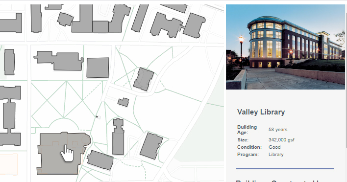
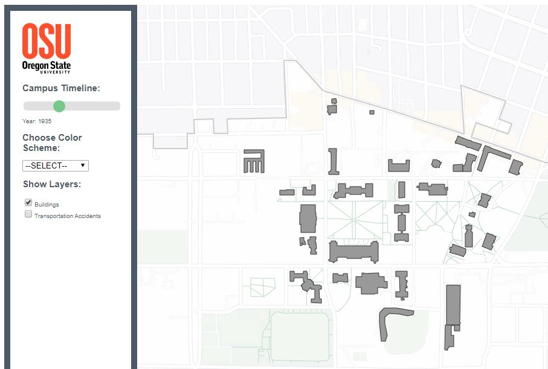
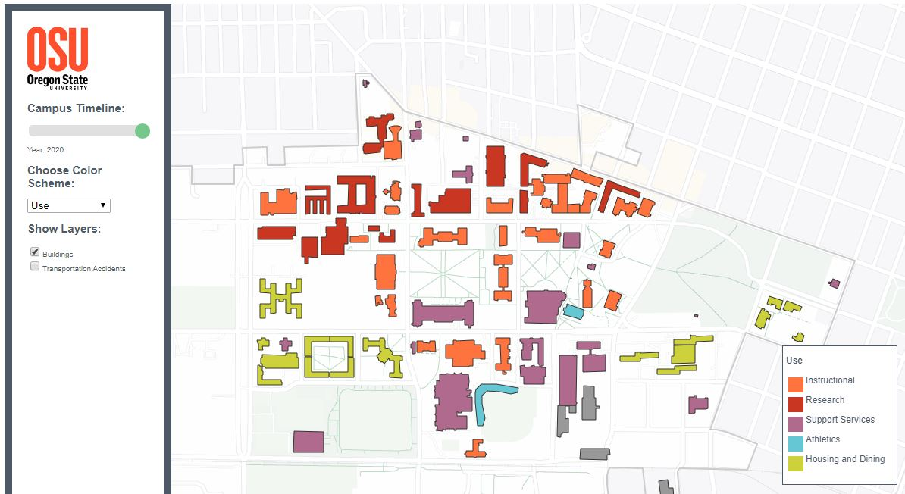
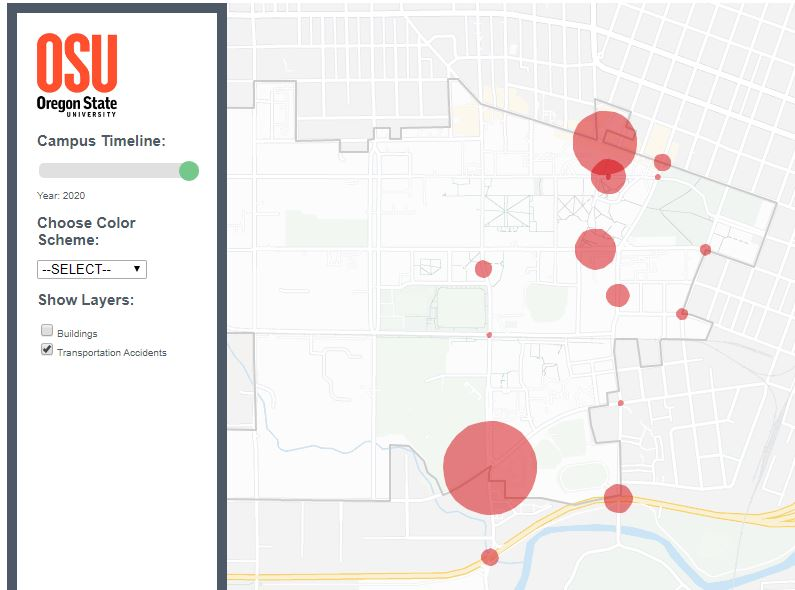

# OSU Campus Inventory

## Description
Oregon State University was struggling to provide facilities for an explosive increase in student enrollment. 
By aggregating existing data into interactive and visual formats, we were able to provide recommendations for efficient 
expansion of the campus.

## Features
#### 1. View Building Data on Hover
- geoJSON properties for each building are displayed in the information sidebar

#### 2. View the Campus as Built, By Year
- Timeline slider filters buildings by year built, and places them on the map

#### 3. View Buildings by Use, Condition, and Historical Designation
- Use the dropdown list to graphically view building properties

#### 4. Toggle Traffic Crash Data
- Circles indicate accident intersections, scaled by number of incidents

&nbsp;

## Technologies
#### 1. HTML/CSS
- Google Maps API
- GeoJSON
#### 2. Javascript
- Filtering & Styling Logic

## Development Roadmap
Development is closed for this project. 

## Contributing
This project is closed to outside contributions.

&nbsp;

## Project status
Development is closed for this project. 
